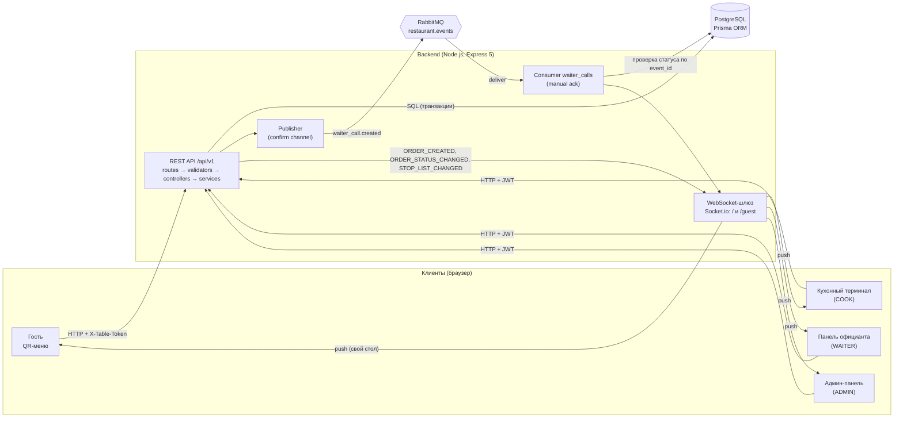
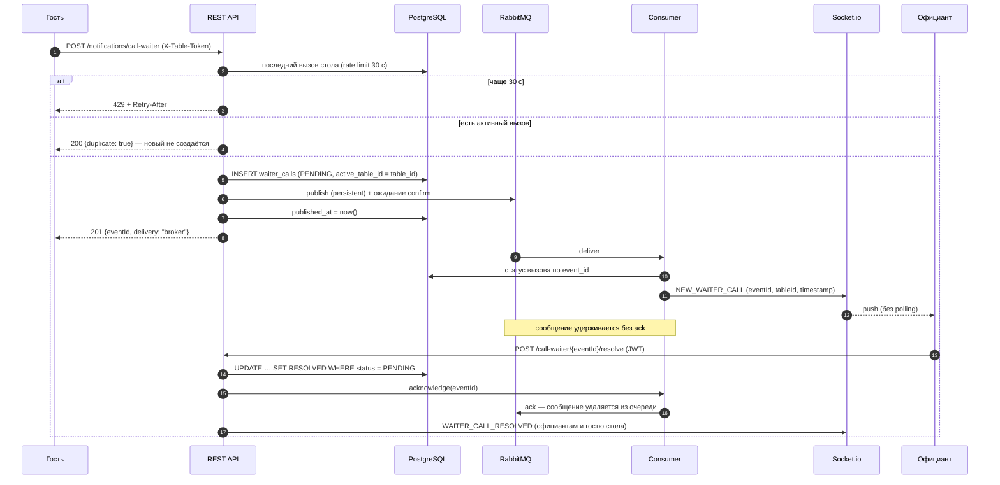

# Архитектура бэкенда

## Компоненты и потоки данных



**Принципы:**

- Клиент не обращается к БД напрямую, только через API. Доступ проверяется на сервере: `authenticate`
  и `authorize(...roles)` для персонала, `requireTableToken` для гостя.
- Слои модуля: `routes` (URL, middleware доступа) → `validator` (Zod, 400) → `controller` (HTTP) → `service`
  (бизнес-логика, транзакции Prisma). Чистая логика вынесена в отдельные файлы без зависимостей от БД
  и покрыта unit-тестами: `order.stateMachine.ts`, `order.pricing.ts`, `waiterCall.consumer.ts`.
- Изменения из нескольких шагов (заказ + позиции + аудит; смена статуса + аудит) выполняются в одной транзакции.
- Реальное время работает без polling БД: события отправляются из сервисов и consumer'а через Socket.io.

## Вызов официанта через брокер (раздел 11 ТЗ)

### Топология RabbitMQ

```
exchange: restaurant.events (direct, durable)
   │  routing key: waiter_call.created
   ▼
queue: waiter_calls (durable, x-dead-letter-exchange = restaurant.events.dlx)
   │  consumer: бэкенд, prefetch 100, manual ack
   ▼  (nack без requeue для повреждённых сообщений)
exchange: restaurant.events.dlx (fanout) ──▶ queue: waiter_calls.dlq
```

`consumer_timeout` увеличен до 24 ч (`docker/rabbitmq/rabbitmq.conf`): сообщение ждёт ack, пока официант не примет вызов.

### Формат сообщения WaiterCall

```json
{
  "event_id": "8d7c1d0e-5b2a-4c1e-9f3e-2a6b7c8d9e0f",
  "type": "WAITER_CALL",
  "table_id": 3,
  "table_number": "3",
  "timestamp": "2026-10-07T12:00:00.000Z"
}
```

AMQP-свойства: `persistent: true`, `content_type: application/json`, `message_id = event_id`, `type = WAITER_CALL`.
`event_id` совпадает с `waiter_calls.id` и служит ключом идемпотентности.
Схема проверяется Zod (`waiterCall.message.ts`).

### Последовательность



### Гарантии

| Ситуация | Поведение |
|---|---|
| Гость жмёт кнопку чаще 1 раза в 30 с | 429 + `Retry-After`. Отсчёт по БД, поэтому лимит переживает перезапуск и действует для всех устройств стола |
| Два одновременных запроса со стола | `UNIQUE(active_table_id)`: второй INSERT падает, возвращается уже созданный вызов |
| Брокер повторно доставил то же сообщение | consumer видит, что `event_id` уже удерживается, — ack копии без отправки на панель |
| Сообщение по уже принятому вызову | consumer читает статус RESOLVED — ack без доставки |
| Бэкенд перезапустился до принятия вызова | сообщение не было подтверждено, RabbitMQ доставляет его снова; панель получает тот же `eventId` с `redelivered: true` |
| Панель официанта была закрыта или отключена | при открытии вызывается `GET /notifications/calls/active` — восстановление из серверного состояния (NFR-09) |
| RabbitMQ недоступен | вызов сохранён с `published_at = NULL` и сразу доставлен по WebSocket напрямую (`delivery: "fallback"`). После переподключения неопубликованные вызовы публикуются (outbox); тот же `eventId` не даёт дубля |
| Повреждённое сообщение | `nack` без возврата в очередь → `waiter_calls.dlq` |
| Официант нажал «Принять» дважды | условный UPDATE меняет данные один раз, повтор возвращает `alreadyResolved: true` |

Ограничение: при нескольких экземплярах бэкенда ack выполняет тот экземпляр, чей consumer получил сообщение.
Для учебного стенда с одним экземпляром этого достаточно. При масштабировании событие «вызов принят»
можно рассылать всем экземплярам через отдельный fanout-exchange.

## WebSocket

| Namespace | Аутентификация | Комнаты | События |
|---|---|---|---|
| `/` | JWT в `auth.token` или `Authorization: Bearer` | `role:ADMIN`, `role:COOK`, `role:WAITER` | `ORDER_CREATED`, `ORDER_STATUS_CHANGED`, `STOP_LIST_CHANGED` (весь персонал); `NEW_WAITER_CALL`, `WAITER_CALL_RESOLVED` (WAITER, ADMIN) |
| `/guest` | `auth.tableToken` (UUID стола) | `table:<id>` | `ORDER_STATUS_CHANGED`, `WAITER_CALL_RESOLVED` своего стола; `STOP_LIST_CHANGED` |

Без валидного JWT подключиться к namespace персонала нельзя. Гость получает события только своего стола.

## Безопасность

- Пароли хранятся как bcrypt-хэш (10 раундов). На несуществующий логин тоже выполняется сравнение хэша,
  поэтому время ответа не выдаёт, существует ли пользователь.
- JWT (HS256) содержит id и роль, роль проверяется middleware на каждом запросе.
- Ограничения частоты: вход — 20 неудачных попыток за 15 минут, гостевые операции — 60 в минуту с IP,
  всё API — 1000 за 15 минут.
- Helmet (заголовки безопасности), CORS по списку origin, JSON не больше 100 КБ.
- Секреты только в `.env` (в `.gitignore`), в репозитории лежит `.env.example`. Конфигурация проверяется при старте.
