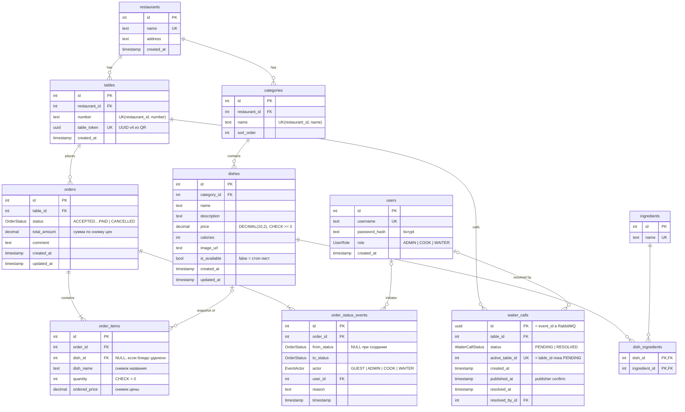

# Модель данных (ER)

Источник истины — [`prisma/schema.prisma`](../prisma/schema.prisma). Таблицы создаёт миграция
[`prisma/migrations/20261007120000_init`](../prisma/migrations/20261007120000_init/migration.sql).

## Таблицы

| Таблица | Назначение | Ключевые ограничения |
|---|---|---|
| `restaurants` | Ресторан. В демо один, модель допускает несколько | `name` уникально |
| `tables` | Стол в зале и его QR-токен | `table_token` UUID уникален; `(restaurant_id, number)` уникальны |
| `categories` | Категории меню | `(restaurant_id, name)` уникальны; удаление только пустой категории |
| `dishes` | Блюда: цена, описание, калорийность, стоп-лист | `price >= 0`; `category_id` ON DELETE RESTRICT |
| `ingredients`, `dish_ingredients` | Ингредиенты, связь многие-ко-многим | составной PK `(dish_id, ingredient_id)` |
| `users` | Персонал | `username` уникален; пароль только в виде bcrypt-хэша |
| `orders` | Заказ стола | индексы `(status, created_at)` для витрины кухни, `(table_id, created_at)` |
| `order_items` | Позиции со снимком названия и цены (BE-06) | `quantity > 0`; `dish_id` ON DELETE SET NULL |
| `order_status_events` | Аудит переходов: откуда, куда, кто, когда (BE-11) | индекс `(order_id, timestamp)` |
| `waiter_calls` | Вызов официанта, источник истины для брокера | `UNIQUE(active_table_id)` + `CHECK`: не более одного PENDING на стол |

## Связи

- Ресторан 1 — N столов, ресторан 1 — N категорий, категория 1 — N блюд.
- Блюдо N — M ингредиентов (через `dish_ingredients`).
- Стол 1 — N заказов, заказ 1 — N позиций, заказ 1 — N событий аудита.
- Позиция заказа N — 0..1 блюдо: ссылка обнуляется при удалении блюда, снимок остаётся.
- Стол 1 — N вызовов официанта; вызов закрывает 0..1 сотрудник.
